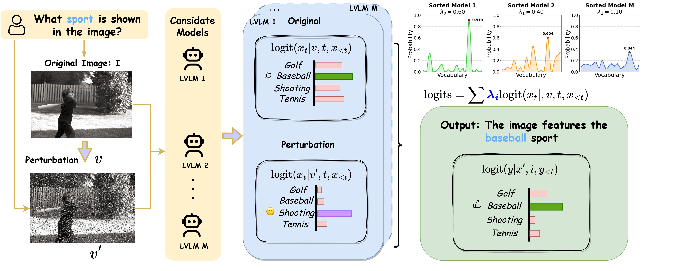

# Beyond Single Models: Mitigating Multimodal Hallucinations via Adaptive Token Ensemble Decoding


## Overview

<p align="center"></p>


Large Vision-Language Models (LVLMs) have recently achieved impressive results in multimodal tasks such as image captioning and visual question answering. However, they remain prone to object hallucination—generating descriptions of nonexistent or misidentified objects. Prior work have partially mitigated this via auxiliary training objectives or external modules, but often lacks scalability, adaptability, or model independence.
To address these limitations, we propose Adaptive Token Ensemble Decoding (ATED), a training-free, token-level ensemble framework that mitigates hallucination by aggregating predictions from multiple LVLMs during inference. ATED dynamically computes uncertainty-based weights for each model, reflecting their reliability at each decoding step. It also integrates diverse decoding paths to improve contextual grounding and semantic consistency.
Experiments on standard hallucination detection benchmarks demonstrate that ATED significantly outperforms state-of-the-art methods, reducing hallucination without compromising fluency or relevance. Our findings highlight the benefits of adaptive ensembling and point to a promising direction for improving LVLM robustness in high-stakes vision-language applications.

## Setup


```
conda env create -f environment.yml
conda activate ated
python -m pip install -e transformers
```

## Implementation


After setup the environment, you can directly use ATED on your own LVLMs by:


# For pope, add some arguments in the generate function
```
llava_gen_cfg = MLLM_model.generate(
        do_sample=True,
        temperature=args.temperature,
        top_p=args.top_p,
        top_k=args.top_k,
        max_new_tokens=1,
        output_attentions = True,
        output_hidden_states=True,
        output_scores=True,
        return_dict_in_generate=True,
        use_cache=True
    )
```

# For the CHAIR metric

<!-- Please refer to `demo.ipynb` [here](https://github.com/shikiw/OPERA/blob/1e74d8b5d082579c81e0e77ef1cf4a44d20ab91e/demo.ipynb) for more details. -->
```
output1 = MLLM_model(
                input_ids = input_ids,
                images = image_tensor,
                output_attentions =False
                output_hidden_states=False,
                use_cache=True,
                return_dict = True
                )
```

for a more efficient version, please use the setting below:
```
output1 = MLLM_model(
                input_ids = input_ids,
                images = image_tensor,
                past_key_values =past_key_values1,
                output_attentions =False
                output_hidden_states=False,
                use_cache=True,
                return_dict = True
                )
```

## Evaluation

The following evaluation requires for MSCOCO 2014 dataset. Please download [here](https://cocodataset.org/#home) and extract it in your data path. you also can use the dataset loading utilities to automatically download the MSCOCO 2014 dataset. 

Besides, it needs you to prepare the following checkpoints of 7B base models:

- Download [LLaVA-1.5 merged 7B model](https://huggingface.co/liuhaotian/llava-v1.5-7b) and specify it at [Line 14](https://github.com/shikiw/OPERA/blob/bf18aa9c409f28b31168b0f71ebf8457ae8063d5/eval_configs/llava-1.5_eval.yaml#L14) of `eval_configs/llava-1.5_eval.yaml`.
- Download [Vicuna 7B v1.1 model](https://github.com/lm-sys/FastChat) and specify it at [Line 25](https://github.com/shikiw/OPERA/blob/bf18aa9c409f28b31168b0f71ebf8457ae8063d5/minigpt4/configs/models/blip2_instruct_vicuna7b.yaml#L25) of `minigpt4/configs/models/blip2_instruct_vicuna7b.yaml`.
- Download [Vicuna 7B v0 model](https://huggingface.co/Vision-CAIR/vicuna-7b/tree/main) and specify it at [Line 18](https://github.com/shikiw/OPERA/blob/bf18aa9c409f28b31168b0f71ebf8457ae8063d5/minigpt4/configs/models/minigpt4_vicuna0.yaml#L18) of `minigpt4/configs/models/minigpt4_vicuna0.yaml`.
- Download [MiniGPT-4 7B pretrained weights](https://drive.google.com/file/d/1RY9jV0dyqLX-o38LrumkKRh6Jtaop58R/view?usp=sharing) and specify it at [Line 8](https://github.com/shikiw/OPERA/blob/bf18aa9c409f28b31168b0f71ebf8457ae8063d5/eval_configs/minigpt4_eval.yaml#L8) of `eval_configs/minigpt4_eval.yaml`.
- Download [LLaVA-NeXT 7B model](https://llava-vl.github.io/blog/2024-01-30-llava-next/) and specify it at [Line 14](https://github.com/shikiw/OPERA/blob/bf18aa9c409f28b31168b0f71ebf8457ae8063d5/eval_configs/llava-next_eval.yaml#L14) of `eval_configs/llava-next_eval.yaml`.

### Arguments

| Argument             | Example             | Description   |
| -------------------- | ------------------- | ------------- |
| `--model`    | `llava-1.5` | Specify the MLLM model, this codebase supports `instructblip`, `minigpt4`, `llava-1.5`, `shikra`. |
| `--data-path`     | `/path/to/dataset` | Path to the dataset file or folder, e.g., `COCO_2014/val2014/`. |
| `--pope-type`     | `random` | Type for POPE evaluation, supports `random`, `popular`, `adversarial`. |
| `--max_new_tokens`     | `1` | set max_new_tokens =1 for POPE evaluation. |
| `--noise-step`      | `999` | The noise-step for image perturbation. Default: `999`. |
| `--fuse`   | `uncertainty` | Choose the ensemble method. Default: `uncertainty`. |

### POPE
```bash
python POPE_dataset_exp.py --model_path1 MODEL_1 --model_path2 MODEL_2 --image-folder /MSCOCO/val2014 --question-file  './POPE/coco/coco_pope_random.json' --answers-file ' ' --use-cd --noise-step 999  --seed 52 --fuse uncertainty
```
Result on `POPE` split:

|      ATED        |  Random   |  Popular  | Adversarial |
|:------------:|:---------:|:---------:|:-----------:|
| **Accuracy** |           |           |             |
| mscoco       | 89.30     | 87.57     | 85.17       |
| gqa          | 90.37     | 86.90     | 84.57       |
| aokvqa       | 89.83     | 85.67     | 79.13       |
| Average      | 89.83     | 86.71     | 82.96       |
| **F1 score** |           |           |             |
| mscoco       | 88.29     | 86.58     | 83.98       |
| gqa          | 90.15     | 85.58     | 83.86       |
| aokvqa       | 89.61     | 85.74     | 80.50       |
| Average      | 89.35     | 85.97     | 82.78       |


### CHAIR

```bash
python CHAIR_dataset_exp.py --model_path1 MODEL_1 --model_path2 MODEL_2 --model_path3 MODEL_3 --image-folder /MSCOCO/val2014 --output_file '' --answers-file ' ' --use-cd --max_new_tokens 512 --noise-step 500  --min_tokens 128 --max_tokens 300 --cd_alpha 1.0 --seed 52 --fuse uncertainty
```
Note: Please check out our released results in `output` for reproduction.

- Calculate CHAIR using the generated jsonl file:
```bash
python CHAIR_Eval.py --cap_file /path/to/jsonl --image_id_key image_id --caption_key caption --coco_path /path/to/COCO/annotations_trainval2014/annotations/ --save_path /path/to/save/jsonl
```

### GPT-4o
The GPT-4V evaluation requires you to specify your API key in [Line 10] of `GPT-4o_Evaluation.py`, and set the output path of your model.
```
python GPT-4o_Evaluation.py
```


## Acknowledgement
This repo is based on the MLLM codebase of [LAVIS](https://github.com/salesforce/LAVIS) and [MiniGPT-4](https://github.com/Vision-CAIR/MiniGPT-4) and [OPERA](https://github.com/shikiw/OPERA), [VCD](https://github.com/DAMO-NLP-SG/VCD). Thanks for their impressive works!


## Citation
If you find this work useful for your research, please cite [our paper]
``` 
```
